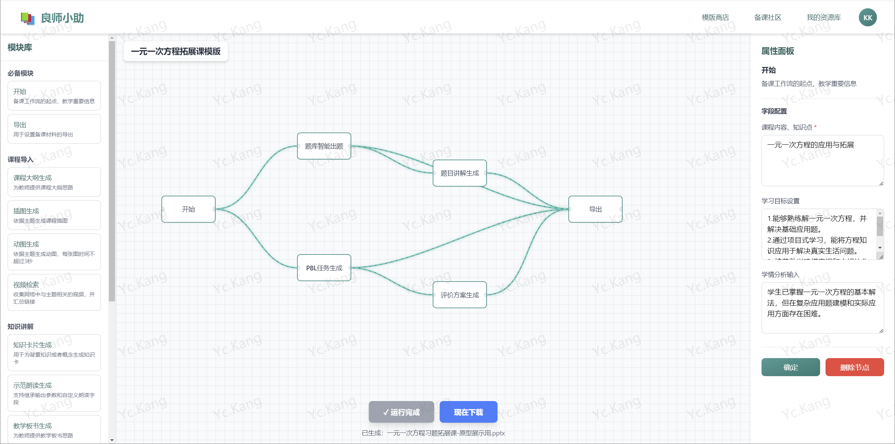
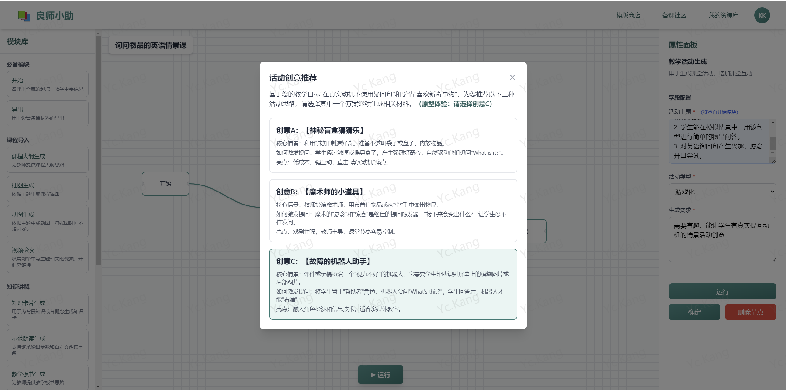
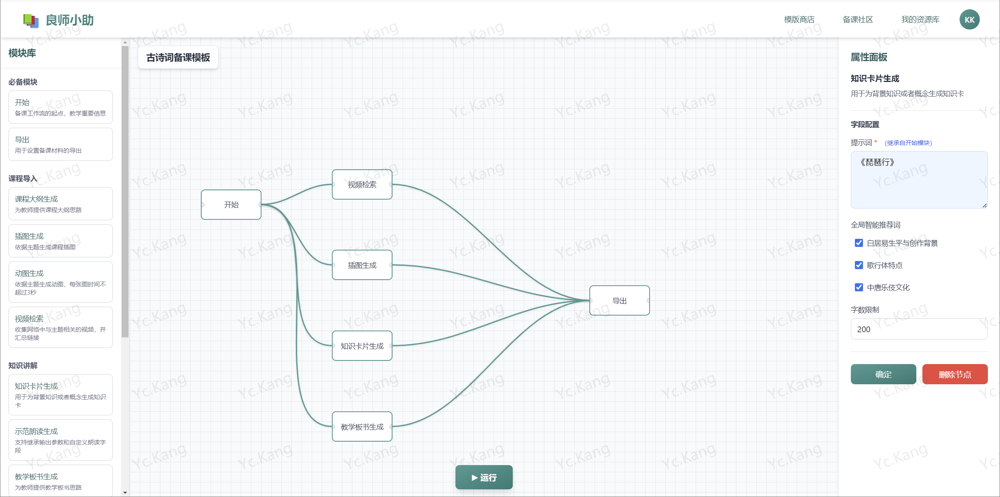
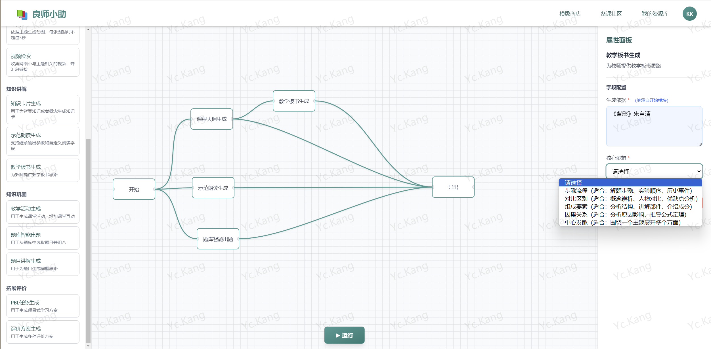

# TeachWise2

良师小助 - 聚合AI大模型,可视化、拖拽式一站备课平台

> **⚠️ 重要说明**：本项目是良师小助的**原型项目**，而非正式产品。  
> **© 2026 创作所有权：Yachao.Kang**  
> 如需参考或借鉴，请与作者联系。

## 产品简介

良师小助是一个基于AI大模型的智能备课平台，通过可视化、拖拽式的工作流编辑器，帮助教师快速生成高质量的教学资源。平台支持多种学科模板，提供从内容生成到素材打包的一站式解决方案。

## 产品截图

### 首页


### 一元一次方程拓展课模板


### 询问物品的英语情景课模板


### 古诗词备课模板


### 工作流编辑器


## 核心功能

### 🎯 可视化工作流编辑
- **拖拽式操作**：通过简单的拖拽操作，将教学模块组合成完整的工作流
- **智能连接**：模块之间支持数据继承和自动关联，实现高效的内容流转
- **实时预览**：工作流执行过程可视化，连接线动画展示数据流向

### 📚 丰富的教学模板

#### 1. 一元一次方程拓展课模板
- **智能出题**：基于课程内容自动生成题目，支持难度和数量自定义
- **题目讲解**：自动生成详细的解题思路和过程
- **PBL任务生成**：创建项目式学习任务，支持小组规模和项目周期设置
- **评价方案**：生成量规评估和过程性分析方案
- **PPT预览下载**：工作流执行完成后，可直接下载AI生成的PPT文件预览

#### 2. 询问物品的英语情景课模板
- **教学活动智能生成**：为缺乏课堂思路的教师提供AI智能化的活动方案推荐
  - 提供多种创意方案（如：神秘盲盒猜猜乐、魔术师的小道具、故障的机器人助手等）
  - 选择方案后自动生成相关教学素材
- **素材自动生成**：根据选定的活动方案，自动生成视频检索、插图、知识卡片、示范朗读等配套素材
- **个性化定制**：支持自定义朗读速度、图片生成数量等参数

#### 3. 古诗词备课模板
- **全局智能推荐**：基于课程内容（如《琵琶行》），智能推荐相关检索词和提示词
  - 视频检索模块：自动推荐"琵琶行赏析"、"唐朝音乐"、"琵琶名曲"等检索词
  - 知识卡片生成：智能推荐"白居易生平与创作背景"、"歌行体特点"、"中唐乐伎文化"等提示词
- **字段自动继承**：模块间字段支持自动继承，修改课程内容后，相关模块自动更新
- **多素材生成**：一键生成视频资源、插图、知识卡片、教学板书等完整教学资源包

### 🔧 强大的模块库

- **开始模块**：设置课程内容、学习目标、学情分析等基础信息
- **题库智能出题**：根据知识点自动生成题目
- **题目讲解生成**：生成详细的解题过程
- **教学活动生成**：AI智能生成课堂活动方案
- **视频检索**：智能检索相关教学视频
- **插图生成**：根据提示词生成教学插图，支持自定义比例
- **知识卡片生成**：自动生成知识点卡片
- **示范朗读生成**：生成语音朗读，支持速度调节
- **教学板书生成**：自动生成板书内容
- **PBL任务生成**：创建项目式学习任务
- **评价方案生成**：生成教学评价方案
- **导出模块**：支持PPT和素材打包两种导出方式

### ✨ 智能特性

- **字段继承机制**：子模块自动继承父模块的相关字段，减少重复输入
- **全局智能推荐**：根据课程内容智能推荐检索词和提示词
- **动态表单**：根据用户选择动态显示相关输入字段
- **实时保存**：所有修改实时保存，支持随时编辑

## 技术栈

- **React 18** - 现代化的前端框架
- **TypeScript** - 类型安全的开发体验
- **Tailwind CSS** - 快速构建美观的UI界面
- **Vite** - 极速的开发构建工具

## 快速开始

### 安装依赖

```bash
npm install
```

### 开发

```bash
npm run dev
```

开发服务器将在 `http://localhost:5173` 启动

### 构建

```bash
npm run build
```

### 预览

```bash
npm run preview
```

## 项目结构

```
TeachWise2/
├── src/
│   ├── components/          # 组件库
│   │   ├── Canvas.tsx       # 画布组件
│   │   ├── PropertyPanel.tsx # 属性面板
│   │   ├── ModuleLibrary.tsx # 模块库
│   │   └── ...
│   ├── pages/               # 页面
│   │   ├── WorkflowEditor.tsx        # 主工作流编辑器
│   │   ├── LinearEquationTemplate.tsx # 一元一次方程模板
│   │   ├── EnglishScenarioTemplate.tsx # 英语情景课模板
│   │   └── AncientPoetryTemplate.tsx # 古诗词模板
│   ├── data/                # 数据定义
│   │   └── modules.ts       # 模块定义
│   └── types/               # 类型定义
│       └── module.ts        # 模块类型
└── public/                  # 静态资源
```

## 使用说明

1. **选择模板**：在首页选择适合的教学模板
2. **编辑工作流**：在画布上拖拽模块，连接模块创建工作流
3. **配置参数**：点击模块，在右侧属性面板中配置参数
4. **执行工作流**：点击"运行"按钮，执行工作流生成教学资源
5. **下载资源**：工作流执行完成后，下载生成的PPT或素材包

## 特色亮点

- 🎨 **可视化编辑**：直观的拖拽式界面，无需编程即可创建复杂工作流
- 🤖 **AI智能生成**：集成多种AI能力，自动生成教学内容
- 🔗 **智能关联**：模块间自动继承和关联，提高备课效率
- 📦 **一键导出**：支持PPT和素材打包两种导出方式
- 🎯 **模板丰富**：覆盖数学、语文、英语等多个学科
- 💡 **智能推荐**：基于课程内容智能推荐相关资源

## 开发计划

- [ ] 支持更多学科模板
- [ ] 增加模块自定义功能
- [ ] 支持工作流保存和分享
- [ ] 集成更多AI模型
- [ ] 优化移动端体验

## 版权声明

本项目为原型项目，所有代码和设计的所有权归 **Yachao.Kang** 所有。

**使用条款**：
- 本项目仅供学习和参考使用
- 未经作者授权，不得用于商业用途
- 如需参考或借鉴本项目，请先与作者联系获得许可
- 引用本项目时，请注明原作者和项目来源

**联系方式**：如需使用或合作，请联系作者 Yachao.Kang

---

## 许可证

本项目为原型项目，保留所有权利。未经授权，不得复制、修改或分发。
